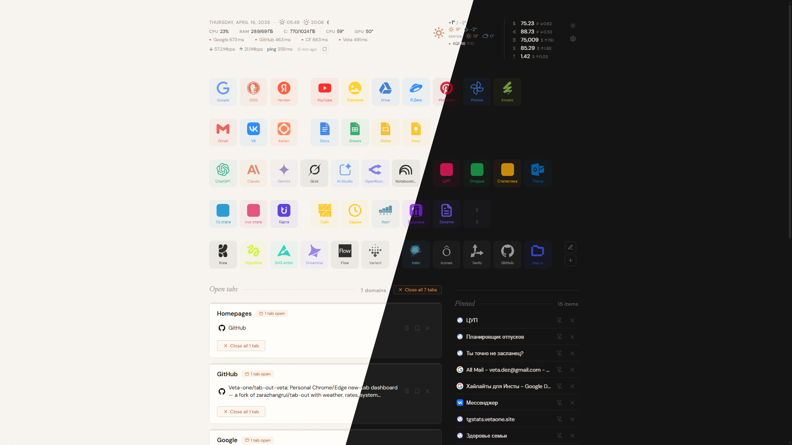

# Tab Out VETA

> **Fork of [Tab Out](https://github.com/zarazhangrui/tab-out) by Zara Zhang**, heavily extended into a personal dashboard.

Pure Chrome/Edge extension (Manifest V3). Your new-tab page, with weather, rates, system metrics, pinned tabs, customisable quick-access shortcuts -- 100% local, no server, no accounts.



---

## Credit

This project started as a fork of **[Tab Out by Zara Zhang](https://github.com/zarazhangrui/tab-out)** -- a minimalist "keep tabs on your tabs" Chrome extension. Zara's original idea and base implementation (domain grouping, landing pages group, confetti close animation, Saved for Later checklist, dupe detection) are preserved. All my additions are built on top of that foundation.

Please star and support [the original project](https://github.com/zarazhangrui/tab-out) too -- it solves a real problem elegantly and is worth following.

---

## What this fork adds

| Feature | Original | This fork |
|---------|:--------:|:---------:|
| Domain grouping + landing pages | + | + |
| Close tabs with confetti + swoosh | + | + |
| Duplicate detection | + | + |
| Saved for Later checklist | + | + (migrated to chrome.storage) |
| **Quick Access shortcuts** (40+ tiles, drag-drop, edit mode, color/icon picker, import/export) | -- | + |
| **Weather widget** (wttr.in -- temp, forecast, sunrise/sunset, moon phase) | -- | + |
| **Currency rates** (USD/EUR via CBR RF; BTC/ETH/SOL/TON via CoinGecko) | -- | + |
| **Air quality (AQI)** via Open-Meteo | -- | + |
| **System metrics** (RAM, Disk, CPU/GPU temps, GPU load, VRAM, fan RPM via LHM) | -- | + |
| **HTTP ping** indicators for configurable hosts | -- | + |
| **Speedtest** (Cloudflare) on demand | -- | + |
| **Pinned tabs** (tab stays open but hidden from Open Tabs grid) | -- | + |
| **Themes** (light / dark / auto by sunrise-sunset) | -- | + |
| **Settings modal** (city picker, currencies, ping hosts, metric toggles, tile scale, tile appearance, backup/restore) | -- | + |
| Custom scrollbars, visibility-aware polling | -- | + |

---

## Architecture

- **Original** (at the fork point, commit `656f6b3`) had a Node.js + Express server with SQLite, communicated with the new-tab page via a postMessage bridge.
- **This fork** migrated everything into the pure Chrome extension -- no server, no Node, no npm. All state lives in `chrome.storage.local`.
- After my fork, [Zara also migrated](https://github.com/zarazhangrui/tab-out/commit/9b800f6) to a pure extension architecture -- great minds think alike.

---

## Install

```bash
git clone https://github.com/Veta-one/tab-out-veta.git
```

1. Open `edge://extensions` (or `chrome://extensions`)
2. Enable **Developer mode**
3. Click **Load unpacked** --> select the `extension/` folder
4. Open a new tab

Works on **Windows, macOS, Linux** -- Chrome and Edge.

The only platform-specific feature is CPU/GPU temperatures which require [Libre Hardware Monitor](https://github.com/LibreHardwareMonitor/LibreHardwareMonitor/releases) (Windows only) running with its remote web server on port 8085. Everything else works cross-platform.

---

## Settings

All state lives in `chrome.storage.local`. Use the gear icon in the header to configure:

- **Weather city** -- autocomplete search (Russian/English)
- **Currencies** -- pick which to track (fiat + crypto)
- **Tile size** -- scale shortcuts up/down
- **Tile appearance** -- background opacity and icon opacity in idle state
- **System metrics** -- toggle CPU, RAM, Disk, temps, GPU load, VRAM, fan
- **Ping hosts** -- add/remove/edit monitored servers
- **Tab title** -- customise what shows in the browser tab
- **Backup / Restore** -- export all settings to JSON, import after OS reinstall

---

## Tech stack

| What | How |
|------|-----|
| Extension | Chrome Manifest V3 |
| Storage | `chrome.storage.local` (mirrored in-memory for sync reads) |
| Fonts | DM Sans + Newsreader (Google Fonts) |
| Weather icons | [erikflowers/weather-icons](https://github.com/erikflowers/weather-icons) (CDN) |
| Brand icons | Simple Icons + custom SVGs |
| Data sources | wttr.in, Open-Meteo (geocoding, AQI), CBR RF, CoinGecko, Cloudflare speedtest, nager.at (holidays), Libre Hardware Monitor (system metrics) |

---

## License

MIT -- same as the original project. Both copyright notices preserved in `LICENSE`.

---

Based on [Tab Out](https://github.com/zarazhangrui/tab-out) by [Zara](https://x.com/zarazhangrui) // Extended by [VETA](https://t.me/VETA14)
